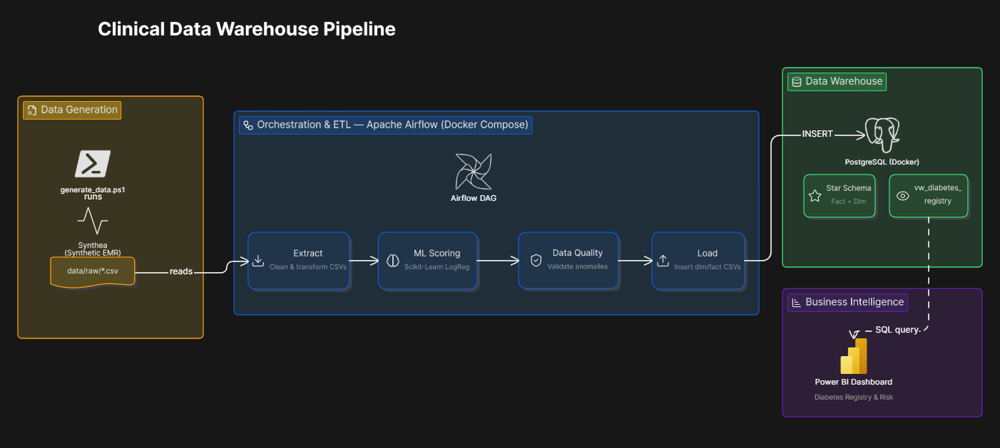
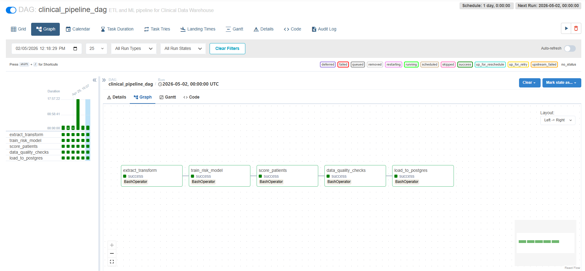
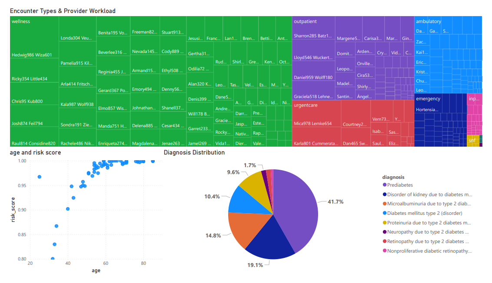

# Clinical Data Warehouse & Disease Registry Pipeline


> An automated end-to-end data engineering pipeline that transforms raw, normalized EMR records into a Star Schema data warehouse — powering a **Diabetes Patient Registry** with predictive risk scoring and clinical BI dashboards.

---

## What Makes This Interesting

- **Realistic clinical data** — Synthea generates HIPAA-compliant synthetic patient records including diagnoses, medications, and encounters.
- **ML risk stratification** — A logistic regression model assigns a readmission risk score to every patient, exposed directly through the registry view.
- **Self-healing pipeline** — Data quality guards in Airflow deliberately fail the DAG on fatal anomalies (negative costs, future birth dates).
- **BI-ready from day one** — Power BI connects directly to a pre-built PostgreSQL view with no post-load wrangling needed.

---

## Architecture Overview



---

## Tech Stack

| # | Layer | Technology | Role |
|---|-------|-----------|------|
| 1 | Data Generation | [Synthea](https://synthetichealth.github.io/synthea/) | Realistic synthetic patient records (CSV) |
| 2 | Database | PostgreSQL (Dockerized) | Hosts the dimensional Star Schema |
| 3 | ETL | Python (`pandas`, `SQLAlchemy`) | Cleans, standardizes, and loads data |
| 4 | Machine Learning | `scikit-learn` Logistic Regression | Assigns readmission risk scores |
| 5 | Orchestration | Apache Airflow | Schedules and sequences pipeline tasks |
| 6 | Visualization | Power BI | Clinical KPIs via `vw_diabetes_registry` |

---

## Prerequisites

Before running the pipeline, ensure the following are installed:

| Tool | Version | Required |
|------|---------|----------|
| Docker Desktop | Latest | ✅ Yes |
| Java | 11+ | ✅ Yes (for Synthea) |
| Python | 3.9+ | ✅ Yes |
| PowerShell | 5.1+ | ✅ Yes |
| Power BI Desktop | Latest | Optional |
| DBeaver / psql | Any | Optional |

---

## Repository Structure

```
.
├── dags/                    # Airflow DAG (clinical_pipeline_dag.py)
├── data/
│   ├── raw/                 # Synthea-generated CSV files
│   └── processed/           # Dimensional CSVs after transformation
├── docs/
│   ├── data_dictionary.md   # Data governance rules and schema definitions
│   ├── architecture.png     # ← Add your architecture diagram here
│   ├── airflow_dag.png      # ← Add your Airflow DAG screenshot here
│   └── powerbi_dashboard.png# ← Add your Power BI screenshot here
├── etl/
│   ├── extract.py
│   ├── transform.py
│   ├── data_quality.py      # Automated sanity checks
│   └── load.py
├── ml/
│   ├── train.py             # Train the readmission risk model
│   └── score.py             # Score all patients
├── scripts/
│   └── generate_data.ps1    # Fetches Synthea and generates mock EMR data
├── sql/
│   ├── ddl/                 # Star Schema table definitions
│   │   ├── fact_encounters.sql
│   │   ├── dim_patients.sql
│   │   └── ...
│   └── views/
│       └── vw_diabetes_registry.sql
├── docker-compose.yml       # Spins up PostgreSQL + Airflow
└── README.md
```

---

## Airflow DAG — Task Flow

```
Extract  →  Train ML Model  →  Score Patients  →  Data Quality Check  →  Load to PostgreSQL
```

Each task runs sequentially. If the **Data Quality Check** detects a fatal anomaly, the DAG fails and no data is loaded.



---

## How to Run

### 1. Generate Synthetic Data

Run the PowerShell script to download Synthea and generate 100 synthetic patient records.

```powershell
.\scripts\generate_data.ps1
```

### 2. Start the Environment

Spin up PostgreSQL and Airflow using Docker Compose.

```powershell
docker-compose up airflow-init
docker-compose up -d
```

### 3. Trigger the Pipeline

Navigate to the Airflow UI, unpause and trigger `clinical_pipeline_dag`.

```
URL:      http://localhost:8081
Username: airflow
Password: airflow
```

The DAG will automatically run:
**Extract → Train ML Model → Score Patients → Data Quality Check → Load to PostgreSQL**

### 4. Connect Power BI

Open Power BI Desktop and connect to PostgreSQL using the credentials below. Import the `vw_diabetes_registry` view to start building clinical dashboards.

```
Host:     localhost:5432
Database: airflow
Username: airflow
Password: airflow
```



---

## Data Quality & Governance

This project implements data governance at two levels:

**Data Dictionary** (`docs/data_dictionary.md`)
Documents every field, data type, nullable flag, and business rule across all dimension and fact tables.

**Automated Sanity Checks** (`etl/data_quality.py`)
Runs as a dedicated Airflow task after scoring. The pipeline **intentionally fails** if any of the following are detected:

- Negative encounter costs
- Future birth dates
- Missing required foreign keys
- Duplicate patient records

**Synthetic data only** — All patient records are generated by Synthea. No real PHI is used or stored at any stage of this pipeline.

---

## Star Schema — Table Overview

| Table | Type | Description |
|-------|------|-------------|
| `fact_encounters` | Fact | Core encounter records with cost, duration, and risk score |
| `dim_patients` | Dimension | Patient demographics and identifiers |
| `dim_conditions` | Dimension | ICD-coded diagnoses |
| `dim_providers` | Dimension | Treating clinicians |
| `dim_date` | Dimension | Calendar date attributes |
| `vw_diabetes_registry` | View | Pre-filtered registry for diabetes patients with risk scores |

---


## Contributing

Contributions are welcome. Please open an issue first to discuss what you'd like to change. For major changes, fork the repo and submit a pull request.

---

## License

[MIT](LICENSE)